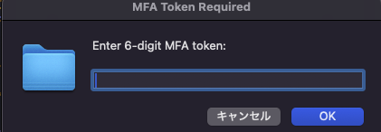

# mfacat - AWS MFA Token Management Tool

AWS MFAトークン管理ツールです。AWS CLIでMFA（多要素認証）を使用する際の認証情報を簡単に取得・管理できます。

## 概要

このツールは以下の機能を提供します：

- **MFAトークンの取得**: 1PasswordからOTPを自動取得、または6桁のMFAトークンを手動入力
- **macOSダイアログによるトークン入力**: システム認証ダイアログでトークンを安全に入力（macOSのみ対応）
- **セッショントークンの取得**: AWS STSから一時的な認証情報を取得
- **認証情報のキャッシュ**: 有効期限内は再認証不要
- **JSON形式での出力**: 他のツールとの連携が容易
- **自動認証設定**: `~/.aws/config`での`credential_process`設定により、AWS CLIやSDKでの自動認証

## 使用シーン

- AWS CLIでMFA認証が必要な環境での作業
- 複数のAWSアカウントの管理
- 1Passwordとの連携によるセキュアな認証（推奨）
- macOSダイアログによる直感的なMFAトークン入力（macOSのみ対応）
- アプリケーションコードでのMFA認証付きAWS利用

## 前提条件

- AWS CLI
- jq (JSON処理ツール)
- 1Password CLI (op) - `--op`オプションを使用する場合のみ必要

## インストール

### 自動インストール（推奨）

```bash
# 完全なセットアップ（依存関係 + mfacat.shのインストール）
make setup

# または個別にインストール
make install-deps  # 依存関係のみ
make install       # mfacat.shのみ
```

### 手動インストール

```bash
# jqのインストール (macOS)
brew install jq

# jqのインストール (Ubuntu/Debian)
sudo apt-get install jq

# jqのインストール (CentOS/RHEL)
sudo yum install jq

# mfacat.shを~/.aws/にコピー
mkdir -p ~/.aws
cp mfacat.sh ~/.aws/mfacat.sh
chmod +x ~/.aws/mfacat.sh
```

インストール後は `~/.aws/mfacat.sh` として実行できます。

## 使用方法

```bash
# 基本的な使用方法（1PasswordからOTPを取得）
/path/to/.aws/mfacat.sh --profile myprofile --access-key-id AKIA... --secret-access-key ... --op "AWS | MyAccount" --serial_number arn:aws:iam::123456789012:mfa/user

# MFAトークンをダイアログから取得する場合（macOSのみ対応）
/path/to/.aws/mfacat.sh --profile myprofile --access-key-id AKIA... --secret-access-key ... --token --serial_number arn:aws:iam::123456789012:mfa/user

# 6桁のMFAトークンを直接指定する場合
/path/to/.aws/mfacat.sh --profile myprofile --access-key-id AKIA... --secret-access-key ... --token 123456 --serial_number arn:aws:iam::123456789012:mfa/user

# ヘルプを表示
/path/to/.aws/mfacat.sh --help
```


**MFAトークンをダイアログから取得する場合（macOSのみ対応）のユーザーのアクション**:
1. コマンドを実行すると、macOSのシステムダイアログが表示されます
2. ダイアログの「Enter 6-digit MFA token:」フィールドに6桁のMFAトークンを入力
3. 「OK」ボタンをクリックして認証を完了
4. ツールが自動的にAWSから認証情報を取得します




## 自動認証設定（推奨）

`~/.aws/config`に設定することで、認証情報の管理を自動化できることです。

**重要**: このツールでは`~/.aws/credentials`ファイルへの設定は不要です。`~/.aws/config`のみに設定してください。

### 設定方法

**設定するファイル**: `~/.aws/config`のみ
**設定不要なファイル**: `~/.aws/credentials`（このファイルには何も設定しないでください）

`~/.aws/config`に設定する際は絶対パス（macOSの場合は`/User/xxxx/.aws/config`）で設定してください


1. **`~/.aws/config`ファイルを編集**
   ```bash
   # ファイルが存在しない場合は作成
   mkdir -p ~/.aws
   touch ~/.aws/config
   
   # エディタで編集
   nano ~/.aws/config
   # または
   vim ~/.aws/config
   ```

2. **プロファイル設定を追加**
   ```ini
   [profile myprofile]
   region = ap-northeast-1
   output = json
   credential_process = /path/to/.aws/mfacat.sh --profile myprofile --op "AWS | MyAccount" --serial_number arn:aws:iam::123456789012:mfa/user
   ```

**注意**: `~/.aws/credentials`ファイルには認証情報を設定しないでください。このツールが自動的に認証情報を管理します。

### 設定例

```ini
# 1Passwordを使用する場合（1PasswordでMFAトークンを設定している場合はこちらが推奨）
[profile production]
region = ap-northeast-1
output = json
credential_process = ~/.aws/mfacat.sh --profile production --access-key-id AKIA... --secret-access-key ... --op "AWS | Production" --serial_number arn:aws:iam::123456789012:mfa/user

# ダイアログからMFAトークンを取得する場合（1PasswordでMFAトークンを設定していない場合はこちらが推奨、macOSのみ対応）
[profile development]
region = ap-northeast-1
output = json
credential_process = ~/.aws/mfacat.sh --profile development --access-key-id AKIA... --secret-access-key ... --token --serial_number arn:aws:iam::123456789012:mfa/user

**設定後の動作**:
- `aws s3 ls --profile development`などのコマンド実行時に、必要に応じてmacOSダイアログが表示されます
- ダイアログでMFAトークンを入力すると、自動的に認証情報が取得されます

# 手動トークンを使用する場合（非推奨）
[profile staging]
region = ap-northeast-1
output = json
credential_process = ~/.aws/mfacat.sh --profile staging --access-key-id AKIA... --secret-access-key ... --token 123456 --serial_number arn:aws:iam::123456789012:mfa/user
```

### 設定項目の説明

- `[profile myprofile]`: プロファイル名（任意の名前）
- `region`: AWSリージョン
- `output`: 出力形式（json, text, table）
- `credential_process`: 認証情報を取得するコマンド（このツールのコマンドを指定）

### ファイル構成

```
~/.aws/
├── config          ← ここに設定（必須）
├── credentials     ← 設定不要（このツールが自動管理）
├── mfacat          ← 生成・設定不要（このツールが自動管理）
└── mfacat.sh       ← このツールの実行ファイル
```

### 設定後の使用方法

```bash
# AWS CLIでの使用
aws s3 ls --profile myprofile
aws ec2 describe-instances --profile myprofile

# 環境変数での使用
export AWS_PROFILE=myprofile
aws s3 ls
```

### 注意事項

- 1Passwordを使用する場合は、事前に`op signin`でログインしておく必要があります
- MFAシリアル番号は、AWS IAMコンソールの「セキュリティ認証情報」から確認できます
- macOSダイアログ機能はmacOSでのみ利用可能です
- `--token`を値なしで指定した場合、有効期限内のキャッシュがある場合はダイアログが表示されません
- **重要**: `~/.aws/credentials`ファイルには認証情報を設定しないでください。このツールが自動的に認証情報を管理します

## オプション

- `--profile`: AWSプロファイル名（必須）
- `--access-key-id`: AWS Access Key ID（必須）
- `--secret-access-key`: AWS Secret Access Key（必須）
- `--token`: 6桁のMFAトークン（`--op`が指定されていない場合は必須）
  - 値を指定しない場合（`--token`のみ）: macOSダイアログからトークンを取得（macOSのみ対応）
  - 値を指定する場合（`--token 123456`）: 指定したトークンを使用
- `--op`: 1Passwordのアイテム名（`--token`の代わりに使用）
- `--serial_number`: MFAシリアル番号（必須）
- `--no-cache`: キャッシュを無視して新しい認証情報を取得
- `--help`: ヘルプを表示

**注意**: 
- `--token`と`--op`は同時に指定できません。どちらか一方を指定してください。
- `--access-key-id`と`--secret-access-key`と`--profile`は必須です。
- `--token`を値なしで指定した場合、有効期限内のキャッシュがある場合はダイアログが表示されません。

## 設定ファイル

### ユーザーが設定するファイル
- **`~/.aws/config`**: プロファイル設定と`credential_process`を指定（必須）

### ツールが自動管理するファイル
- **`~/.aws/credentials`**: 設定不要（このツールが自動的に認証情報を管理）
- **`~/.aws/mfacat`**: 認証情報のキャッシュ（TOML形式、自動生成・管理）

認証情報は `~/.aws/mfacat` にTOML形式でキャッシュされます（実行ファイルとは別のファイルです）：

```toml
[myprofile]
aws_access_key_id = "AKIA..."
aws_secret_access_key = "..."
aws_session_token = "..."
expiration = "2025-07-01T03:53:42Z"
```

## 機能

- **AWS MFAトークンの取得**: 1PasswordからOTPを自動取得（推奨）、または6桁のMFAトークンを手動入力
- **macOSダイアログによるトークン入力**: `--token`オプションを値なしで指定すると、macOSのシステム認証ダイアログが表示される（macOSのみ対応）
  - ユーザーは6桁のMFAトークンをダイアログに入力するだけで認証が完了
  - コマンドラインでの手動入力が不要で、より安全で使いやすい
- **認証情報のキャッシュ**: 有効期限内は再認証不要（`~/.aws/mfacat`に保存）
- **1Passwordとの連携**: `--op`オプションで1PasswordからOTPを自動取得
- **6桁MFAトークンの直接指定**: `--token`オプションで手動入力
- **認証情報の直接指定**: `--access-key-id`と`--secret-access-key`でプロファイルに依存しない認証
- **JSON形式での出力**: 他のツールとの連携が容易
- **自動認証設定**: `~/.aws/config`での`credential_process`設定により、AWS CLIやSDKでの自動認証

## アンインストール

```bash
make uninstall
```

## 参考リンク

- [1Password CLI Documentation](https://developer.1password.com/docs/cli/get-started/)
- [AWS CLI Documentation](https://docs.aws.amazon.com/cli/latest/userguide/getting-started-install.html)
- [jq Documentation](https://stedolan.github.io/jq/)